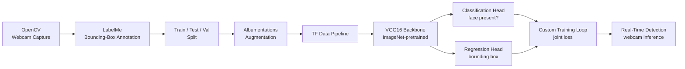
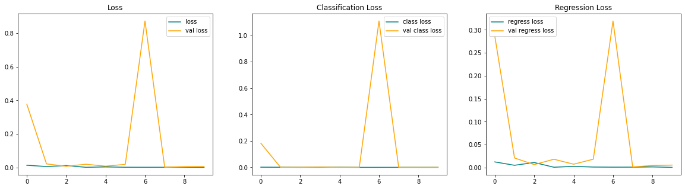

# Focal

Real-time face detection and localization built end-to-end on a custom-collected, custom-annotated dataset with TensorFlow.

## Overview

Most face-detection demos wrap an off-the-shelf detector. Focal instead owns the full pipeline: capturing raw webcam images, hand-annotating bounding boxes, augmenting a small dataset into a trainable one, and training a dual-head network that jointly predicts *whether* a face is present and *where* it is. The result runs live against a webcam feed.

The core engineering problem is bounding-box regression on top of a pretrained CNN backbone, trained jointly with a classification head under a single custom loss and training loop.

## Pipeline



## Technical Approach

- **Single-stage, dual-head architecture.** One shared VGG16 backbone (pretrained on ImageNet, top removed) feeds two independent heads — a sigmoid classifier for face presence and a 4-unit sigmoid regressor for the bounding box — so a single forward pass yields both outputs.
- **Normalized bounding boxes.** Coordinates are scaled to `[0, 1]` relative to image dimensions, keeping the regression head resolution-independent and letting Albumentations' bbox-aware transforms compose cleanly with image transforms.
- **Custom joint loss.** A hand-written localization loss (sum of squared coordinate and width/height deltas) is combined with binary cross-entropy classification loss (`localization + 0.5 * classification`) inside a custom `tf.keras.Model` subclass that overrides `train_step`/`test_step`, rather than relying on Keras' default multi-output loss dict.
- **Augmentation-driven dataset growth.** ~90 raw webcam captures are split into train/test/val, then each image is expanded 60x via Albumentations (random crop, horizontal/vertical flip, brightness/contrast, gamma, RGB shift), producing 3,780 / 840 / 780 training/test/validation samples. Crops that lose the face during augmentation become explicit negative examples (class 0, zero bbox), giving the classifier real non-face samples.

## Tech Stack

| Purpose | Tool |
|---|---|
| Model & training | TensorFlow / Keras, pretrained VGG16 |
| Annotation | LabelMe |
| Augmentation | Albumentations |
| Capture & inference I/O | OpenCV |
| Data handling / viz | NumPy, Matplotlib |

## Repo Structure

```
Focal/
├── README.md
├── notebooks/
│   └── focal.ipynb       # full pipeline: capture -> annotate -> augment -> train -> detect
├── assets/
│   └── loss_curves.png   # training/validation loss curves
├── requirements.txt
└── .gitignore
```

Datasets, augmented data, trained model weights, and training logs are generated locally and are not committed (see `.gitignore`).

## Setup & Run

```bash
git clone <this-repo-url>
cd Focal
python -m venv venv
venv\Scripts\activate        # Windows
source venv/bin/activate     # macOS/Linux

pip install -r requirements.txt
jupyter notebook notebooks/focal.ipynb
```

Run the notebook top to bottom, section by section:

1. **Setup & data collection** — `CAMERA_INDEX` (default `0`) controls which webcam OpenCV opens; adjust if you have more than one camera. Captures land in `data/images/`.
2. **Annotation** — launches LabelMe to draw one bounding box per image; labels are saved as JSON alongside the images.
3. **Partitioning** — manually move images into `data/{train,test,val}/images` (and matching labels get moved automatically), then run the Albumentations pipeline to populate `aug_data/`.
4. **Training** — builds the VGG16-backed dual-head model and trains for 10 epochs, logging to `logs/` (TensorBoard-compatible).
5. **Real-time detection** — loads the trained model and runs live inference against the webcam feed, drawing a bounding box and label when face confidence exceeds 0.5.

## Results

The notebook's included training run (10 epochs, batch size 8, Adam @ 1e-4 with decay) converges from a total loss of 0.35 to 0.002, with validation loss following the same trend outside of a transient spike around epoch 7:



The notebook's qualitative detection outputs (annotated training batches, predicted bounding boxes on test images) were captured against the original author's own webcam photos and have been removed from this repo, since it's now published under a different name; only the face-free loss curves are kept as evidence.

## Limitations & Possible Improvements

- **Small, single-subject dataset.** ~90 raw images from one person in one environment; generalization to other faces, lighting, and backgrounds is untested.
- **Single-face assumption.** The model outputs exactly one bounding box per frame regardless of how many faces are present.
- **No formal detection metrics.** Evaluation is via the training/validation loss curves and visual inspection — no IoU or mAP computed against held-out ground truth.
- **Manual steps in the loop.** Annotation and the train/test/val split are manual; there's no automated re-training pipeline.
- **Backbone size.** VGG16 is a comparatively heavy backbone; a lighter one (e.g. MobileNet) would likely reduce inference latency with some accuracy trade-off.
